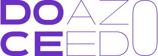

  

  🏳️‍🌈 Non-binary (he/they) • 🧡 Svelte evangelist • 👨‍💻 Live coder • 🔓 FOSS supporter • 🤓 Unicode nerd

  
  
  
  
  &nbsp;
  
  
  

---

Hello and welcome to my personal code compendium. 👋📚 You can call me Doce, I'm a developer that truly enjoys to translate concept ideas to meaningful experiences.

🔴 I do live coding streams on [Twitch](https://twitch.tv/doceazedo911) from Tuesday to Thursday @ 7:30pm (GMT-3).

## ☕ Keep in touch:

- [📹 Twitch](https://twitch.tv/doceazedo911)
- [🐤 Twitter](https://twitter.com/doceazedo911)
- [🐘 Mastodon](https://svelte.gay/@doceazedo)
- [📸 Instagram](https://instagram.com/doceazedo911)
- [🎮 Discord](https://discordapp.com/users/241978119899185165)
- [🎵 Last.fm](https://last.fm/user/doceazedo911)
- [💼 LinkedIn](https://linkedin.com/in/doceazedo)
