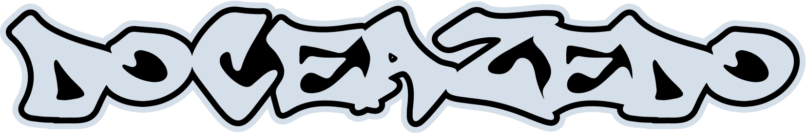

  

  🏳️‍🌈 He/they • 🦄 Unicorn developer • 🧡 Svelte evangelist • 🔓 FOSS supporter • 🤓 Unicode nerd

  
  
  
  
  
  
  

---

Hello and welcome to my personal code compendium. 👋📚 Call me Doce, I'm a developer who also does UI/UX design and music.

## ☕ Keep in touch:

- [🦋 Bluesky](https://bsky.app/profile/doceazedo.com)
- [🎮 Discord](https://discordapp.com/users/241978119899185165)
- [🎵 Last.fm](https://last.fm/user/doceazedo911)
- [📀 Discogs](https://www.discogs.com/user/doceazedo/collection)
- [💼 LinkedIn](https://linkedin.com/in/doceazedo)
